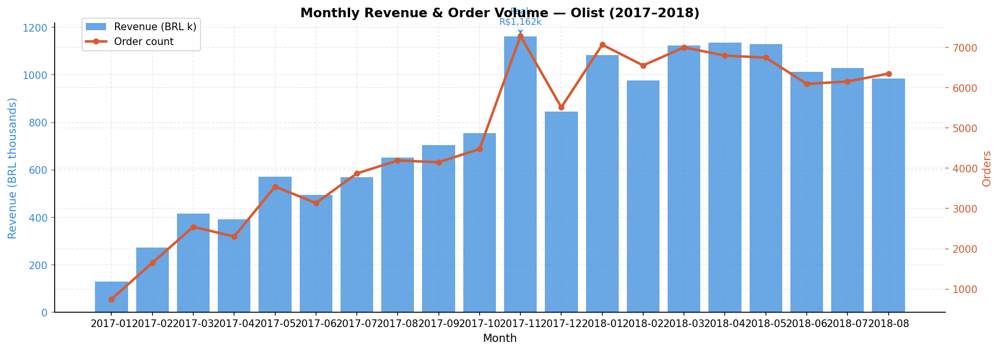

# 🛒 Olist E-Commerce Sales Analysis

> **End-to-end Business Analysis** | SQL · Python · Excel · Tableau

Analysed **99,441 real orders** across Brazil's largest e-commerce marketplace to uncover what drives revenue, where logistics breaks down, and why customers leave bad reviews — then translated every finding into an actionable business recommendation.

---

## 📊 Live Dashboard

🔗 **[View Interactive Tableau Dashboard](https://public.tableau.com/app/profile/priyanshu.moudgil/viz/OlistE-CommerceSalesAnalysis_17793927587150/Dashboard1)**



---

## 🎯 Business Problem

Olist connects thousands of small Brazilian merchants to major marketplaces. With 8× revenue growth in under 2 years comes serious operational complexity. This analysis answers 5 questions a BA would face on day one:

1. Is the business growing — and when are the seasonal peaks?
2. Which product categories drive the most revenue?
3. Which states are high-value markets vs untapped opportunities?
4. How reliable is delivery — and does it affect customer satisfaction?
5. Which payment methods do customers prefer, and does it vary by order size?

---

## 🔍 Key Findings

| # | Finding | Insight |
|---|---------|---------|
| 1 | **Revenue grew 667% in 20 months** | From R$128K in Jan 2017 → R$985K in Aug 2018. November 2017 peaked at R$1.16M — Black Friday effect |
| 2 | **São Paulo = 37.4% of all revenue** | SP + RJ + MG together control 62.6% of national revenue — extreme geographic concentration |
| 3 | **Health & Beauty is the #1 category** | R$1.23M revenue with a 4.19 star avg rating — highest revenue AND high satisfaction |
| 4 | **Late delivery kills review scores** | Pearson r = -0.584. States with 20%+ late delivery average 0.4 stars lower than on-time states |
| 5 | **92.1% of orders delivered on time** | But Alagoas (AL) hits 24.2% late rate — 4× worse than São Paulo's 5.9% |
| 6 | **Credit card dominates at 75.3%** | But credit card buyers spend R$162 avg vs boleto R$144 — higher ticket, not just more popular |
| 7 | **Office Furniture worst rated category** | 3.52 stars with 25.4% negative reviews — 1 in 4 customers unhappy |
| 8 | **Orders delivered in 1-5 days score 4.35 stars** | Orders taking 21-30 days drop to 3.52 — a 0.83 star gap purely from speed |

---

## 💡 Business Recommendations

**1. Fix logistics in Northeast Brazil — immediately**
Alagoas (24.2% late), Maranhão (20.4%), and Sergipe (16.4%) are dragging down national customer satisfaction. These states also pay 18-21% of order value in freight — nearly double São Paulo's 12.2%. Partner with regional logistics providers and set a hard internal KPI of <10% late delivery per state.

**2. Invest aggressively in Health & Beauty**
It's the only top-5 revenue category that also scores above-average in customer satisfaction (4.19 stars). This combination — high revenue + happy customers — makes it the safest category to expand. Recruit more sellers, offer promotional placements, and reduce commission rates for new Health & Beauty merchants.

**3. Fix or exit Office Furniture**
R$268K revenue sounds good until you see 25.4% of customers are unhappy. Either audit product quality and seller standards in this category, or reduce its prominence in search results until satisfaction improves. Unhappy customers don't come back.

**4. Prepare for Q4 twelve weeks in advance**
November revenue hit R$1.16M — 112% MoM growth in one month. That kind of spike breaks logistics networks. Pre-position inventory in October, increase seller capacity alerts in September, and set delivery expectation buffers for November to protect the review score spike that follows Black Friday.

**5. Target boleto users for high-ticket categories**
Credit card gets all the attention at 75.3% of orders — but boleto users average R$144 per order and show up heavily in computers, furniture, and office equipment. These are deliberate, high-value purchases. Build targeted retention campaigns and loyalty offers specifically for boleto customers.

---

## 🛠️ Tools & Skills Demonstrated

| Tool | What I Used It For |
|------|--------------------|
| **SQL (SQLite)** | 6 business queries across 9 joined tables — revenue trends, geographic breakdown, delivery performance, category analysis, review correlation, payment behaviour |
| **Python (pandas, matplotlib, seaborn)** | Data cleaning, merging 9 tables into one master dataframe, 6 production-quality charts, statistical correlation analysis (Pearson r = -0.584) |
| **Tableau Public** | Interactive 4-chart dashboard — revenue trend, category performance, delivery by state, payment methods |
| **Excel (openpyxl)** | Formatted 5-sheet stakeholder summary with auto-width columns, header styling, and frozen panes |
| **Jupyter Notebook** | End-to-end reproducible analysis with markdown commentary explaining every business decision |

---

## 📊 Charts Generated

| Chart | Key Insight |
|-------|------------|
| Monthly Revenue Trend | 667% growth, clear Black Friday spike Nov 2017 |
| Top 10 Categories | Health & Beauty #1 at R$1.23M |
| State Revenue Map | SP + RJ + MG = 62.6% of all revenue |
| Delivery Performance | AL worst at 24.2% late, SP best at 5.9% |
| Review Correlation | Faster delivery = higher rating (r = -0.584) |
| Payment Methods | Credit card 75.3%, boleto users spend more |

---

## 📁 Project Structure

```
olist-ecommerce-analysis/
│
├── data/                          # Raw CSVs (not tracked — see .gitignore)
│
├── sql/
│   ├── q1_monthly_revenue.sql     # Revenue trend by month
│   ├── q2_top_categories.sql      # Top 20 categories by revenue + market share
│   ├── q3_state_revenue.sql       # All 27 states — revenue, freight cost, concentration
│   ├── q4_delivery_performance.sql# On-time vs late — national + by state
│   ├── q5_reviews_by_category.sql # Review score distribution per category
│   └── q6_payment_methods.sql     # Payment method breakdown + by category
│
├── notebooks/
│   └── olist_eda_notebook.ipynb   # Full Python EDA — 11 sections, 6 charts
│
├── outputs/
│   ├── monthly_revenue_trend.png
│   ├── top_categories.png
│   ├── state_revenue.png
│   ├── delivery_analysis.png
│   ├── review_correlation.png
│   ├── payment_methods.png
│   └── olist_analysis_summary.xlsx
│
├── setup_database.py              # Loads all 9 CSVs into SQLite with verification
├── .gitignore                     # Excludes raw data and database file
└── README.md
```

---

## 🚀 How to Reproduce This Analysis

```bash
# 1. Clone the repository
git clone https://github.com/PriyanshuMoudgil12/olist-ecommerce-analysis.git
cd olist-ecommerce-analysis

# 2. Download the dataset from Kaggle
# kaggle.com/datasets/olistbr/brazilian-ecommerce
# Place all 9 CSV files into the data/ folder

# 3. Install dependencies
pip install pandas matplotlib seaborn openpyxl

# 4. Load data into SQLite database
python setup_database.py

# 5. Run the full analysis
jupyter notebook notebooks/olist_eda_notebook.ipynb
# Kernel → Restart & Run All
```

---

## 📦 Dataset

| Detail | Info |
|--------|------|
| Source | [Kaggle — Brazilian E-Commerce Public Dataset by Olist](https://www.kaggle.com/datasets/olistbr/brazilian-ecommerce) |
| Tables | 9 relational CSV files |
| Orders | 99,441 delivered orders (2016–2018) |
| Products | 32,951 unique products across 73 categories |
| Geography | All 27 Brazilian states |
| Time period | January 2017 — August 2018 (full months only) |

---

## 🎓 About This Project

Built as part of my Business Analysis portfolio during BBA (5th Semester) to demonstrate end-to-end BA skills — from raw data extraction to executive-level business recommendations.

**Connect:** [LinkedIn](https://linkedin.com/in/priyanshu-moudgil) | [GitHub](https://github.com/PriyanshuMoudgil12)
