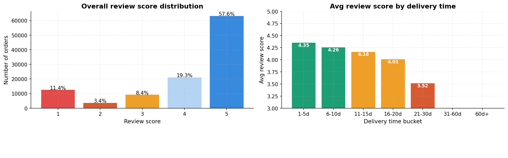

# 🛒 Olist E-Commerce Sales Analysis

> 99,441 real orders. 9 relational tables. One simple question: why are some Brazilian states giving Olist 4.4-star reviews and others giving 3.5?

🔗 **[Live Tableau dashboard →](https://public.tableau.com/app/profile/priyanshu.moudgil/viz/OlistE-CommerceSalesAnalysis_17793927587150/Dashboard1)**


---

## The problem

Olist is the largest e-commerce marketplace in Brazil — it connects small merchants to big platforms like Mercado Livre and Submarino. Between 2017 and 2018 the platform grew revenue **8×** in under two years. That kind of growth comes with serious operational pain: deliveries get slower, complaints rise, certain states become unprofitable to serve, and nobody on the inside has time to look at the patterns.

I took the public Olist dataset (Kaggle, ~100K orders, 9 normalised tables) and approached it the way a Business Analyst at any growing marketplace would on day one — pulling the data into SQL, asking the five questions a stakeholder would actually ask, and turning each answer into a recommendation.

---

## What it does

- Loads **9 relational CSVs** (orders, customers, payments, reviews, items, sellers, geolocation, products, categories) into a SQLite warehouse
- Runs **6 SQL queries** covering the entire revenue funnel — acquisition → fulfillment → satisfaction
- Computes a **state-level Pearson correlation** between late-delivery rate and review score
- Generates **6 publication-quality charts** in Python (matplotlib + seaborn)
- Packages findings into a **5-sheet Excel workbook** for stakeholder consumption
- Ships an interactive **4-chart Tableau Public dashboard**
- Translates 8 statistical findings into **5 prioritized business recommendations**

---

## Tech stack


---

## How to run it locally

```bash
git clone https://github.com/PriyanshuMoudgil12/olist-ecommerce-analysis.git
cd olist-ecommerce-analysis
pip install pandas numpy scipy matplotlib seaborn openpyxl jupyter
```

Then:

1. **Download the data** from Kaggle — [Olist Brazilian E-Commerce dataset](https://www.kaggle.com/datasets/olistbr/brazilian-ecommerce). Place all 9 CSVs in `data/`.

2. **Build the SQLite warehouse:**
   ```bash
   python3 setup_database.py
   ```
   This loads all 9 CSVs into `olist.db` and sets up the joins.

3. **Open the analysis notebook:**
   ```bash
   jupyter notebook notebooks/olist_eda_notebook.ipynb
   ```
   Walks through every query with markdown commentary explaining each business decision.

4. **Run any of the 6 SQL queries directly:**
   ```bash
   sqlite3 olist.db < sql/q1_monthly_revenue.sql
   ```

5. **See the interactive dashboard online:** [Tableau Public link](https://public.tableau.com/app/profile/priyanshu.moudgil/viz/OlistE-CommerceSalesAnalysis_17793927587150/Dashboard1)

---

## Key findings

1. **Revenue grew 673% in 20 months.** From R$127K (Jan 2017) to R$985K (Aug 2018). November 2017 peaked at **R$1.15M** — pure Black Friday effect.

2. **The market is dangerously concentrated.** São Paulo alone is **37.4%** of national revenue. SP + RJ + MG together = **62.5%** of every real Olist earned. The platform's growth is structurally tied to the wealth of three states.

3. **State-level Pearson r = −0.86 between late-delivery rate and review score.** The states with the worst delivery (Alagoas at 23.9% late) score **0.4 stars lower** on average than the best (São Paulo at 5.9% late). This is the single biggest operational lever in the data.

4. **Speed beats price for satisfaction.** Orders delivered in 1–5 days average **4.35 stars**; orders taking 21–30 days drop to **3.52**. A 0.83-star gap from delivery speed alone.

5. **Health & Beauty is the perfect category.** Highest revenue (R$1.23M) AND highest customer satisfaction (4.19 stars). It's the only top-5 category that doesn't have a trade-off between volume and quality.

6. **Office Furniture is the worst.** R$268K revenue but 3.52 stars and **25.4% negative reviews** — 1 in 4 customers leaving unhappy.

7. **Credit card is dominant but boleto is high-value.** 75.3% of orders use credit card at R$162 average; 18.6% use boleto at R$144 average — and boleto buyers cluster around high-ticket categories like computers and furniture.



The 5 recommendations in the executive summary cover: (1) fix Northeast logistics immediately, (2) invest in Health & Beauty, (3) fix or exit Office Furniture, (4) prepare for Q4 twelve weeks in advance, (5) target boleto users for high-ticket categories.

---

## What I learned

- **The interesting question is usually "why?", not "what?".** Aggregate statistics like "revenue grew 673%" are easy to compute. The insight came from segmenting — by state, by category, by delivery speed — and finding the correlations that explained the headline number. A flat "revenue grew" chart is forgettable. A 4.35 → 3.52 star drop by delivery speed bucket is memorable.

- **SQL window functions are worth the learning curve.** Most of my Q1 monthly-revenue query is one CTE plus a window function. Without windows, I'd have written four nested subqueries that nobody can read or maintain.

- **State-level analysis is more honest than national averages.** "91.9% of orders are on-time" sounds fine until you see Alagoas at 23.9% late. National averages hide the operational problems that actually matter to specific customers. The stakeholder doesn't care about the country mean — they care about which states are pulling it down.

- **A correlation of −0.86 changes the conversation.** I went into this expecting a vague "delivery probably affects reviews" finding. The number is so strong that it elevated "fix Northeast logistics" from a nice-to-have to the headline recommendation. A single hard number has outsized persuasive power in a memo.

---

## What I'd add next

- **Customer cohort analysis.** Right now I treat each order independently. The next step is to group customers by their first-purchase month and track 30/60/90-day repeat rates — that tells Olist which acquisition cohorts produce loyal customers, not just one-time buyers.

- **A simple churn / dormancy model.** Logistic regression of "will a customer come back within 90 days" against their first-order experience (delivery time, category, payment method). Quantify what predicts retention instead of just describing it.

- **A simulated A/B test write-up.** Pick one of my recommendations (say, prioritizing logistics investment in the Northeast) and write the experimental design — hypothesis, sample size calculation, primary metric, success criteria, expected lift. Turns the analysis into a testable plan, not just a report.

---

**Priyanshu Moudgil** · BBA, 5th Semester · open to Summer / Winter 2026 analyst internships

- GitHub: [@PriyanshuMoudgil12](https://github.com/PriyanshuMoudgil12)
- LinkedIn: [linkedin.com/in/priyanshu-moudgil](https://linkedin.com/in/priyanshu-moudgil)
